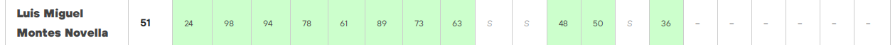

# Code challenge (2021)

Soluciones de los problemas resueltos en la competición [Codechallenge](https://oicampus.telefonica.com/proyecto/code-challenge) organizada por Telefónica.

## Organización del repositorio

El repositorio está organizado en directorios, uno por problema, en cada uno podemos tener los siguientes fiheros:

* README.md: enunciado del problema
* app.py: script Python con la solución
* sampleInput: entrada de muestra la misma que en el enunciado
* sampleOutput: entrada de salida, la misma que en el eneunciado
* testInput: entrada de test
* testOutput: resultado de test
* submitInput: datos para la fase de submit
* submitOutput: resultado de la fase submit

## Problemas resueltos

* [01](01)
* [02](02)
* [03](03)
* [04](04)
* [05](05)
* [06](06)
* [07](07)
* [08](08)
* [11](11)
* [12](12)
* [14](14)

## Posición en el ranking final

